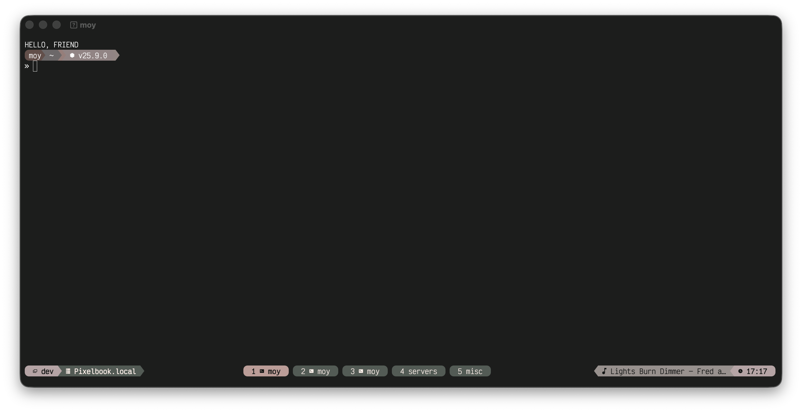

# Redoing My Dotfiles: From Fish to Zsh and Mastering Tmux

For a long time, I was happily riding the Fish shell train. It was fast, the defaults were incredibly sensible, and the autosuggestions were life-changing. But recently, I found myself yearning for the raw compatibility and ecosystem that Zsh offers, especially as I integrate more advanced tooling into my workflow.

Over the past week, I ripped off the band-aid and completely redid my [dotfiles](https://github.com/AguirreMoy/dotfiles). The main goals? Switching back to Zsh and finally getting a Tmux setup that doesn't just work, but actively enhances my productivity—specifically when jumping between multiple "dev-sessions" and CLI-based AI agents.

## The Return to Zsh

Fish is fantastic, but POSIX compliance is a real hurdle when you're moving fast. As I started leaning more heavily on complex scripts and modern development environments (like AI coding assistants and CLI agents), the friction of translating bash/zsh installation scripts and commands into Fish was starting to add up.

I decided to migrate back to Zsh, but this time, I wanted to do it right. No bloated, sluggish frameworks. I set up `sheldon` as my plugin manager and embraced `zsh-patina` to keep my environment clean and incredibly fast. It feels just as snappy as Fish, but with none of the compatibility headaches. I also integrated the `ghostty` terminal emulator, and the combination is lightning fast.

## Mastering Tmux for AI "Dev-Sessions"

The most significant upgrade in this rewrite, however, was my Tmux configuration. I've always used Tmux for basic session persistence, but I wanted a setup specifically tailored for modern development—which, for me, involves running multiple AI agents concurrently.

Here are the key changes I made to my Tmux workflow:

- **The Prefix Rebind:** I initially experimented with remaping my prefix to `ctrl-space`, but ultimately settled on `ctrl-a`. It just feels more natural and is easier to hit when you're flying across the keyboard between panes.
- **Workflow & Alerts:** I added audible alerts and improved the dev workflow integration. Now, when a long-running task or an AI agent finishes its job in a background pane, Tmux actively lets me know.
- **Theming with Hellwal:** I integrated `hellwal` to dynamically theme my Tmux cache and sessions, keeping the aesthetics cohesive across my entire environment.

With this setup, I can spin up a dedicated "dev-session" for a project: one window running my local server, another open in my editor, and a dedicated pane running a tool like Gemini CLI. Jumping between these contexts is completely frictionless. It finally feels like I have a terminal environment tailored exactly to how I think and work.

## What's Next?

The journey of tweaking your environment never truly ends. But for the first time in a while, I feel like my tools are getting out of my way rather than dictating how I work. If you're struggling to wrangle multiple AI agents in a single terminal window, I highly recommend investing a weekend into your Tmux setup!
